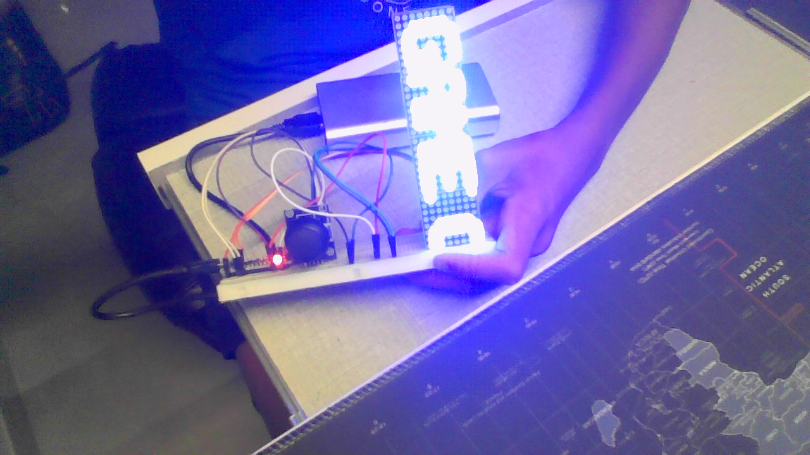
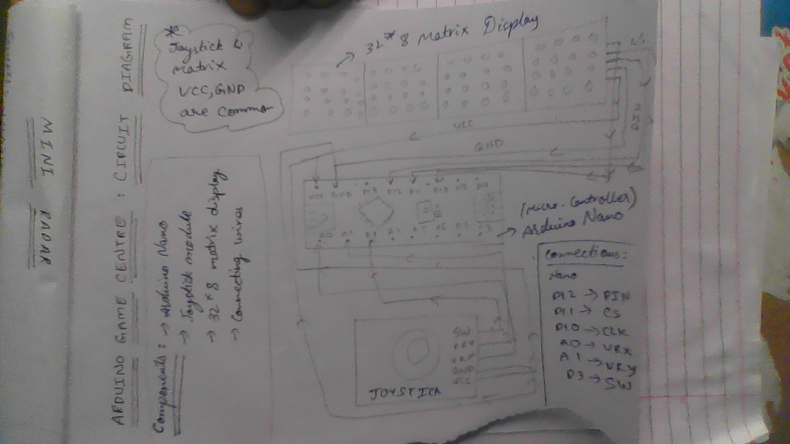

# Arduino Game Centre

A mini game centre made with an Arduino Nano, 32×8 MAX7219 LED matrix and joystick.

## Games

* Catch Dot
* Snake
* Dodge
* Stack

## Features

* Game selection menu
* Joystick controls
* Score system
* Game over screen
* Multiple mini games on one display
* Simple startup messages

## Components

* Arduino Nano
* 32×8 MAX7219 LED Matrix
* Joystick module
* Jumper wires

## Wiring

### MAX7219 Matrix

| Matrix | Arduino Nano |
| ------ | ------------ |
| VCC    | 5V           |
| GND    | GND          |
| DIN    | D11          |
| CS     | D10          |
| CLK    | D13          |

### Joystick

| Joystick | Arduino Nano |
| -------- | ------------ |
| VCC      | 5V           |
| GND      | GND          |
| VRX      | A0           |
| VRY      | A1           |
| SW       | D3           |

## Libraries

This project uses:

* MD_MAX72XX
* MD_Parola
* SPI

## How to Play

After powering on, the display shows the game centre menu.

Move the joystick up or down to select a game.

Press the joystick button to start.

Each game has its own controls and scoring system.

## Project

Built as a small Arduino gaming project using an LED matrix and joystick.

## Build model 

The code is in `game_centre.ino`.

## Circuit Diagram 

